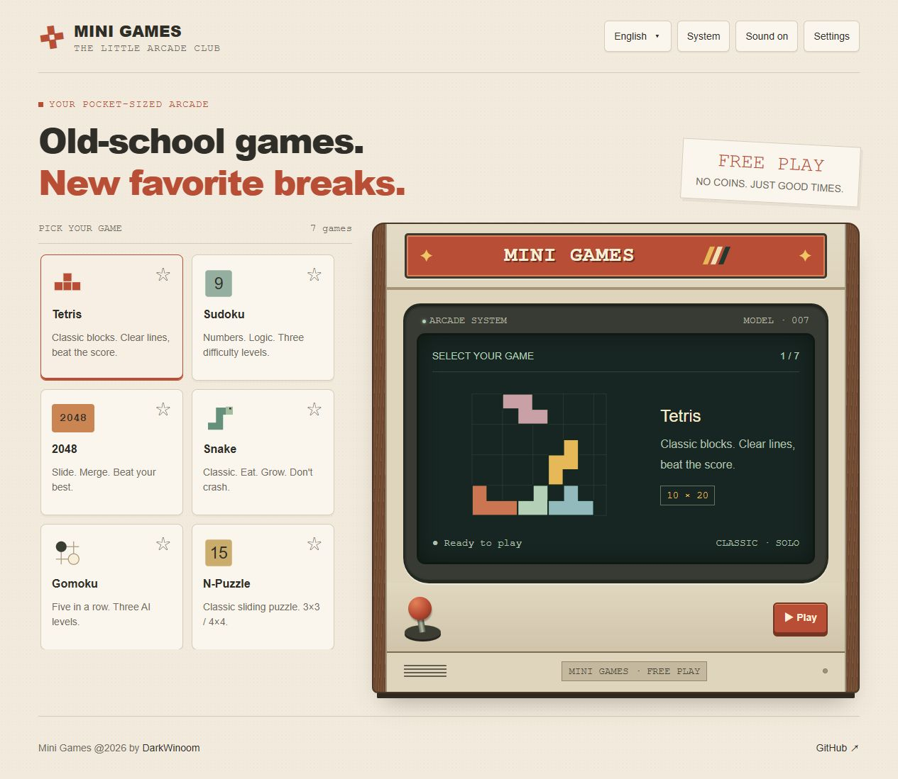

# Mini Games

Seven classic games in a little retro arcade. Open your browser, pick a game, and take a break.

**[Play now](https://dw-mini-games.netlify.app/)** · English | [简体中文](./README.zh-CN.md)



## Pick your game

| Game           | How to play                                                                                         |
| -------------- | --------------------------------------------------------------------------------------------------- |
| Tetris         | Rotate falling blocks and fill horizontal lines. Save a piece for later and see what's coming next. |
| Sudoku         | Fill each row, column and box with 1–9. Three difficulties, pencil notes and a three-mistake limit. |
| 2048           | Slide matching numbers together. Reach 2048, then keep going. Undo your last move when needed.      |
| Snake          | Eat to grow. Keep clear of the walls and your own tail.                                             |
| Gomoku         | Connect five stones before the computer does. Choose from three AI difficulties.                    |
| N-Puzzle       | Slide the numbers into order on a 3×3 or 4×4 board. Undo moves and improve your time.               |
| Bubble Shooter | Aim and shoot matching colors. Groups of three or more pop, and unsupported bubbles fall.           |

The game room scrolls as the collection grows. Click a star to pin a favorite to the front; click it again to remove the favorite.

## At the controls

Every game shows its controls below the screen. Action buttons display the same shortcut keys and names.

| Game              | Main controls                                                                                                                       |
| ----------------- | ----------------------------------------------------------------------------------------------------------------------------------- |
| Tetris            | ←/→ or A/D to move; ↑/W to rotate; Z to rotate left; ↓/S to soft drop; Space to drop; C/Shift to hold; P to start, pause or resume. |
| Sudoku            | Click a cell and use 1–9 or the number pad. N toggles notes; Delete/Backspace clears a cell.                                        |
| 2048 / Snake      | Arrow keys, WASD or swipe. U undoes a move in 2048; Space starts, pauses or resumes Snake.                                          |
| Gomoku / N-Puzzle | Click or tap the board. U undoes a move in N-Puzzle.                                                                                |
| Bubble Shooter    | Move the pointer to aim and click to shoot, or aim and tap on a touchscreen. Space pauses or resumes.                               |

**R** starts a new game. **Esc** returns to the game room. Leaving an unfinished run asks for confirmation. Smaller screens also show touch controls for the directional games.


## Make yourself at home

- **Language:** Chinese and English are included. Your first visit uses your browser language; your choice is then remembered. Click the language name to switch.
- **Favorites:** Starred games stay at the front after you refresh.
- **Appearance:** Choose a light room, a dark room, or follow your system theme.
- **Sound:** The header switch controls game sound effects.
- **Records:** Best scores and records are saved in this browser. A current run ends when you leave or reload; records do not sync between devices. Clearing browser data removes them.

Settings also accepts custom JSON language packs. Missing entries fall back to English, so a pack can be extended over time.

In Sudoku notes mode on small screens, a dot marks a cell with notes. Select the cell to read its notes in the panel.

The games run entirely in your browser. No account or backend is required.

## Run locally

Use a recent Node.js release (22+ recommended) and pnpm 11.

```sh
pnpm install
pnpm dev
```

Open the local address printed in the terminal, usually `http://localhost:5173`.

```sh
pnpm test       # behavior regression tests
pnpm typecheck  # TypeScript checks
pnpm build      # create the static site in dist/
pnpm preview    # preview the production build
```

The `dist/` folder can be hosted on a static web host. Games use hash routes, so opening or refreshing a game does not require server-side routing rules.

## About

Made by [DarkWinoom](https://github.com/DarkWinoom). Found a problem or have a game idea? [Open an issue](https://github.com/DarkWinoom/mini-games/issues).

Released under the [MIT License](./LICENSE).
