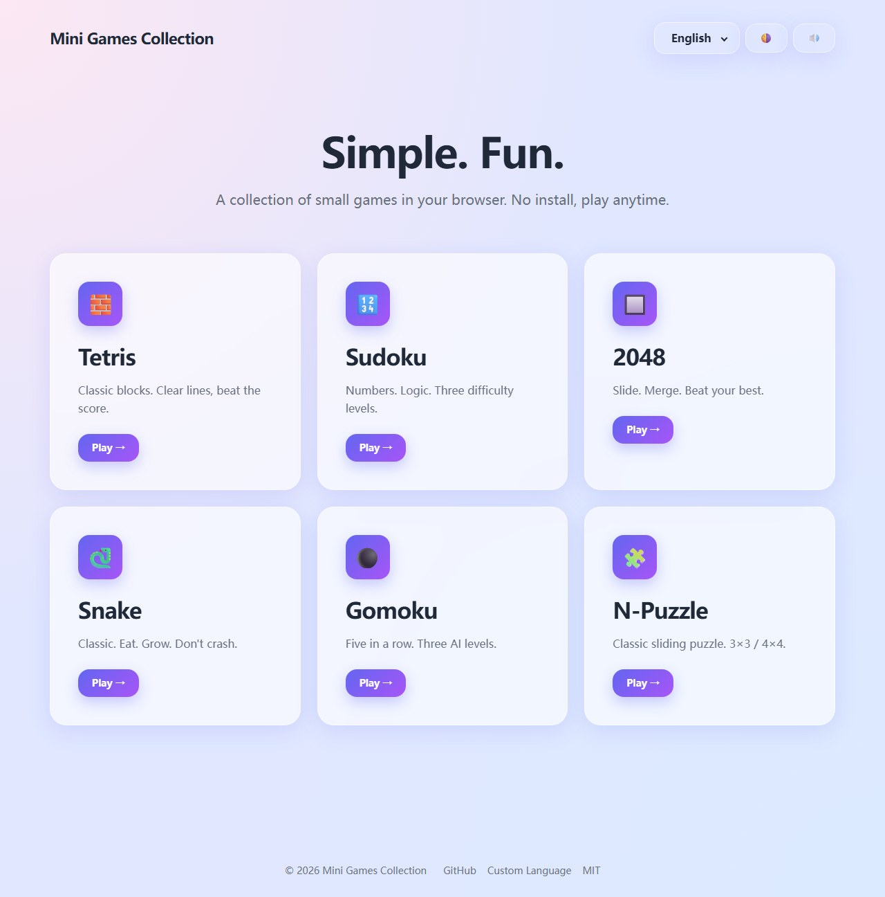

# Mini Games Collection

A small collection of casual browser games.
No backend, no tracking, no install — just static files.

[Play Now](https://dw-mini-games.netlify.app/)

English | [中文](./README.zh-CN.md)



## Quick Start

Requires [Node.js](https://nodejs.org/) 20+ and [pnpm](https://pnpm.io/) 11+.

```bash
pnpm install
pnpm dev
```

Open `http://localhost:5173` in your browser.

### Common Scripts

```bash
pnpm dev         # start the dev server
pnpm build       # type-check and bundle to dist/
pnpm preview     # preview the production build locally
pnpm typecheck   # type-check only (vue-tsc)
```

Output goes to `dist/` and can be deployed to any static host
(GitHub Pages, Cloudflare Pages, Vercel, etc.).

## Tech Stack

- **Framework**: [Vue 3](https://vuejs.org/) 3.5
- **Routing**: [vue-router](https://router.vuejs.org/) 4
- **State**: [Pinia](https://pinia.vuejs.org/) 2
- **Styling**: [Tailwindcss](https://tailwindcss.com/) 3
- **Build**: [Vite](https://vitejs.dev/) 5
- **Types**: [TypeScript](https://www.typescriptlang.org/) 5
- **Package Manager**: [pnpm](https://pnpm.io/) 11

## Games

| Game | Status | Description |
| ---- | ------ | ----------- |
| Tetris | ✅ Done | Classic 10×20 grid, SRS rotation, 7-bag randomizer, Hold / Next 3, T-Spin / Back-to-Back / Combo / SFX |
| Sudoku | ✅ Done | 9×9 grid, 3 difficulty levels, 3-error fail, notes mode, per-difficulty best times |
| 2048 | ✅ Done | 4×4 sliding merge, 1-step undo, challenge 2048 / 4096+ |
| Snake | ✅ Done | 20×20 classic direction control, eat food to grow, 180° reverse prevention |
| Gomoku | ✅ Done | 15×15 board, 3 AI difficulties (Random / Heuristic / Minimax), AI thinking highlights candidate points |
| N-Puzzle | ✅ Done | Classic sliding puzzle, 3×3 (8-puzzle) / 4×4 (15-puzzle) sizes, single-step undo, per-size best records |
| Bubble Shooter | ✅ Done | 12-row brick-layout board, 6 colors, 3+ match to pop, isolated bubbles fall, keyboard + mouse aim, focus auto-pause |

## Custom Language Packs

Built-in languages: Chinese (zh-CN) and English (en-US). Browser language is
auto-detected; the header has a manual switcher.

To add a custom language pack:

1. Click "Custom Language" in the footer
2. Paste a JSON blob (same structure as the built-in packs)
3. Save — it takes effect immediately and shows up in the language list

## Theme

Three modes:

- Light (default)
- Dark
- System (follow OS)

Click the theme icon in the header to cycle (☀️ / 🌙 / 🌗).
Your choice is persisted in the browser.

## Sound

A global mute toggle in the header controls SFX for all games.
Click the speaker icon (🔊 / 🔇) to silence or restore; the choice is
persisted in the browser. Hover any header button for a tooltip.

## Contributing

Issues, pull requests, and new game ideas are welcome.
Please keep game rules consistent with the classic versions.

## License

[MIT](./LICENSE)
