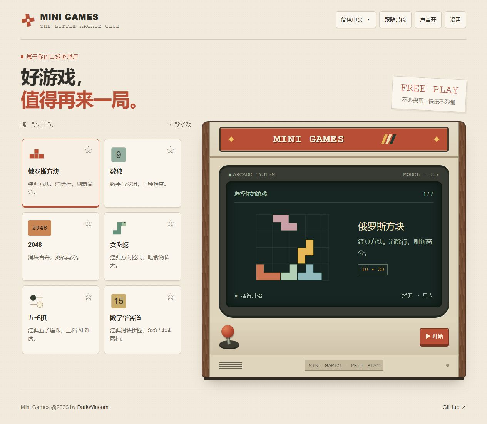
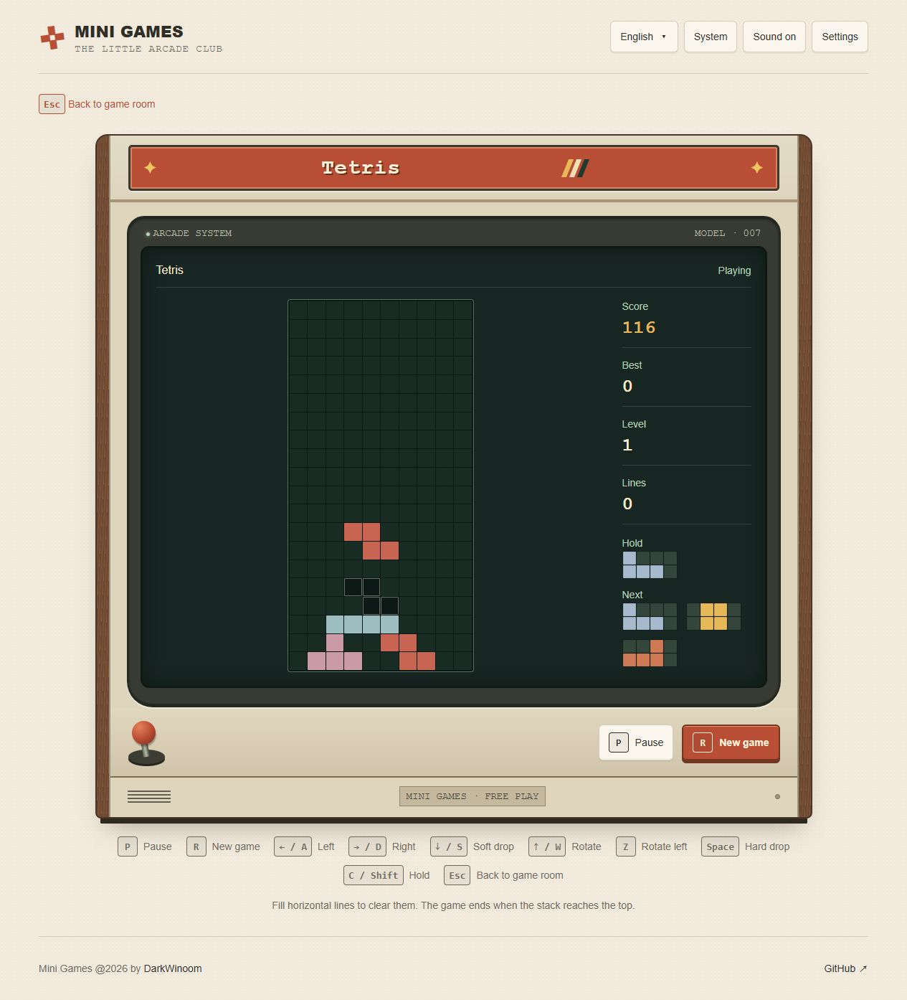

# Mini Games

把七款经典小游戏装进一台怀旧街机。打开浏览器，挑一款游戏，随时来一局。

**[开始游玩](https://dw-mini-games.netlify.app/)** · [English](./README.md) | 简体中文



## 挑一款游戏

| 游戏       | 怎么玩                                                                 |
| ---------- | ---------------------------------------------------------------------- |
| 俄罗斯方块 | 旋转落下的方块，填满横行即可消除。支持暂存方块和查看后续方块。         |
| 数独       | 每行、每列、每宫填入 1–9，不可重复。提供三档难度、笔记和三次错误限制。 |
| 2048       | 滑动合并相同数字，达到 2048 后继续挑战。需要时可以撤销上一步。         |
| 贪吃蛇     | 吃食物让蛇变长，避开墙壁和自己的身体。                                 |
| 五子棋     | 与电脑轮流落子，先连成五颗获胜。提供三档 AI 难度。                     |
| 数字华容道 | 滑动方块，将数字排回顺序。支持 3×3、4×4、撤销及最佳记录。              |
| 泡泡龙     | 瞄准并发射泡泡，三个及以上同色泡泡相连即可消除，失去支撑的泡泡会掉落。 |

游戏目录可以滚动浏览。点击星标收藏游戏，它会排到前面；再次点击即可取消收藏。

## 操作方式

每款游戏的屏幕下方都有操作说明，按钮左侧会显示相同的快捷键。

| 游戏                | 常用操作                                                                                              |
| ------------------- | ----------------------------------------------------------------------------------------------------- |
| 俄罗斯方块          | ←/→ 或 A/D 移动；↑/W 旋转；Z 逆时针旋转；↓/S 缓降；Space 直接落下；C/Shift 暂存；P 开始、暂停或继续。 |
| 数独                | 点击格子后使用 1–9 或数字面板填数；N 切换笔记；Delete/Backspace 清除。                                |
| 2048 / 贪吃蛇       | 方向键、WASD 或滑动操作；2048 用 U 撤销，贪吃蛇用 Space 开始、暂停或继续。                            |
| 五子棋 / 数字华容道 | 点击或轻触棋盘；数字华容道用 U 撤销。                                                                 |
| 泡泡龙              | 移动指针瞄准、点击发射；触屏上可瞄准后轻触发射；Space 暂停或继续。                                    |

**R** 开始新一局，**Esc** 返回游戏厅。离开尚未结束的游戏时会弹出确认。小屏幕还会为方向控制类游戏提供屏幕操作按钮。



## 按自己的习惯游玩

- **语言**：内置简体中文和英文。首次访问读取浏览器语言，此后记住你的选择；点击顶部语言名称即可切换。
- **收藏**：收藏的游戏会置顶，刷新后依然保留。
- **外观**：可选择明亮、暗色或跟随系统主题。
- **声音**：顶部开关统一控制游戏音效。
- **记录**：最佳分数与记录保存在当前浏览器中；离开或刷新会结束当前这一局。记录不会跨设备同步，清除浏览器数据也会清除记录。

设置中可以导入自定义 JSON 语言包，缺失的词条会回退到英文，方便逐步补充。

小屏幕的数独笔记模式下，圆点表示格子中有笔记；选中格子后，可在面板中查看具体数字。

所有游戏均在浏览器中运行，无需账号或后端服务。

## 在本地运行

使用较新的 Node.js（推荐 22 及以上）和 pnpm 11。

```sh
pnpm install
pnpm dev
```

打开终端显示的本地地址，通常为 `http://localhost:5173`。

```sh
pnpm test       # 运行行为回归测试
pnpm typecheck  # 检查 TypeScript 类型
pnpm build      # 生成 dist/ 静态网站
pnpm preview    # 预览生产构建
```

`dist/` 可部署到静态网站托管平台。游戏使用 Hash 路由，直接打开或刷新游戏页面无需额外配置服务器路由。

## 关于

作者：[DarkWinoom](https://github.com/DarkWinoom)。遇到问题或有新游戏想法，欢迎[提交 Issue](https://github.com/DarkWinoom/mini-games/issues)。

项目使用 [MIT 许可证](./LICENSE)。
